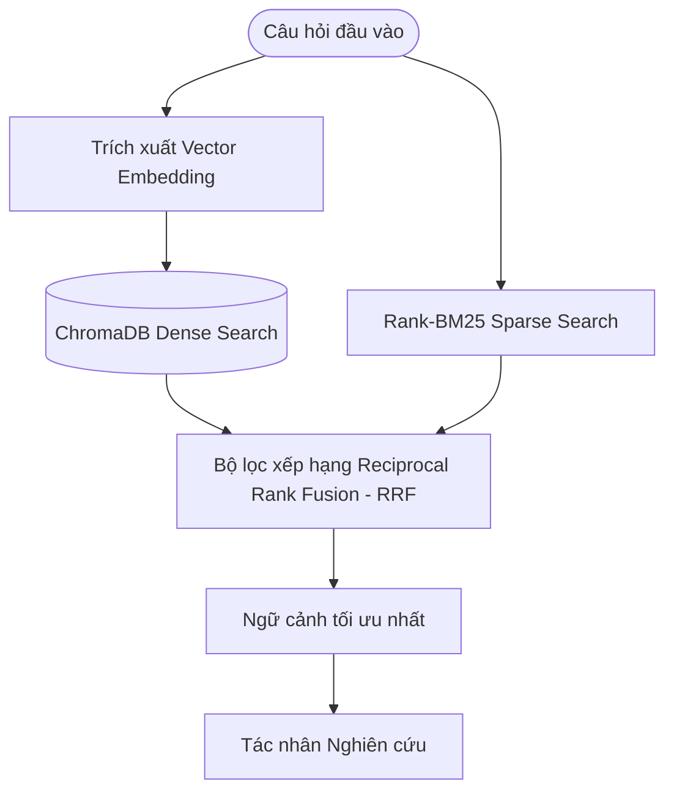
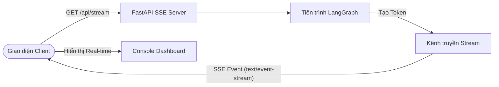
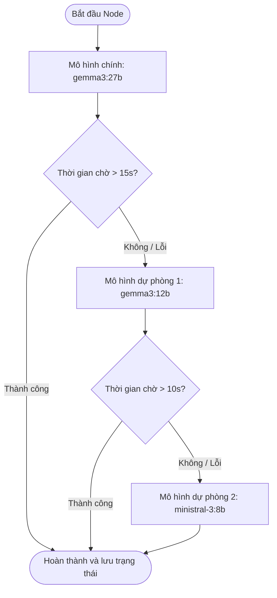

<h1 align="center">Hệ thống phân tích chiến lược kiến trúc và tự động hóa báo cáo doanh nghiệp dựa trên Multi-Agent</h1>

<p align="center">
  
  
  
  
  
</p>

<p align="center">
  Giải pháp tự động hóa tư vấn công nghệ thông tin và chuyển đổi số cho doanh nghiệp sử dụng kiến trúc đa tác nhân (Multi-Agent) thông minh kết hợp cơ chế truy xuất tri thức lai (Hybrid RAG) và định tuyến động. Dự án giải quyết bài toán tối ưu hóa quy trình tiền khả thi (Pre-sales), phá vỡ các rào cản thông tin nội bộ và tự động hóa việc biên soạn báo cáo kỹ thuật chuẩn chỉnh.
</p>

---

<h2 align="center">Kiến trúc hệ thống và luồng điều phối đa tác nhân</h2>

<p align="center">
  Hệ thống được thiết kế theo mô hình phân tách độc lập giữa dịch vụ máy chủ Backend (FastAPI xử lý đồ thị AI) và giao diện người dùng Frontend (Dashboard hiển thị trực quan). Mọi luồng tính toán đều được điều khiển bởi đồ thị trạng thái tuần tự LangGraph, cho phép quản lý trạng thái phiên làm việc (Stateful Session) thông qua cấu trúc dữ liệu chung <code>ResearchState</code>.
</p>

### 1. Cơ chế định tuyến động (Dynamic Routing)
Tùy thuộc vào câu hỏi đầu vào của người dùng, bộ định tuyến có điều kiện (Conditional Router) sẽ tự động phân tích độ phức tạp để phân nhánh xử lý:
- Nhánh từ chối: Chặn ngay lập tức tại tác nhân lọc ngữ cảnh nếu câu hỏi không thuộc phạm vi công nghệ hoặc vận hành doanh nghiệp.
- Nhánh Hỏi - Đáp đơn giản (Q&A Flow): Bỏ qua các bước phân tích sâu và đi thẳng từ Tác nhân Nghiên cứu đến Tác nhân Biên soạn báo cáo nhằm rút ngắn thời gian xử lý và tiết kiệm chi phí vận hành API.
- Nhánh phân tích chiến lược (Strategic Flow): Kích hoạt tuần tự toàn bộ 6 tác nhân AI để tiến hành so sánh đối chiếu kiến trúc, đánh giá rủi ro an ninh mạng và lập lộ trình triển khai chi tiết kèm KPI.

### 2. Vai trò của các tác nhân chuyên biệt trong quy trình tư vấn
- Tác nhân Lọc ngữ cảnh (Guardrail Agent): Đảm nhận vai trò chốt chặn bảo mật, xác thực ngữ cảnh câu hỏi đầu vào, lập luận và phân loại tính hợp lệ.
- Tác nhân Nghiên cứu (Researcher Agent): Thực hiện truy vấn hệ thống tri thức, tổng hợp tài liệu thực tế và các nghiên cứu điển hình từ cơ sở dữ liệu.
- Tác nhân Phân tích (Analyst Agent): Phân tích ưu và nhược điểm của các giải pháp công nghệ, xây dựng ma trận đánh đổi đa chiều.
- Tác nhân Đánh giá rủi ro (Risk Assessor Agent): Nhận diện rủi ro kỹ thuật, rủi ro vận hành và thiết lập ma trận phân loại mức độ rủi ro tương ứng.
- Tác nhân Đề xuất lộ trình (Recommender Agent): Hoạch định kế hoạch triển khai chi tiết qua từng giai đoạn và xác định các chỉ số KPI đo lường hiệu quả.
- Tác nhân Biên soạn báo cáo (Reporter Agent): Tổng hợp dữ liệu từ các tác nhân trước để biên soạn báo cáo hoàn chỉnh dưới định dạng Markdown và kết xuất sơ đồ kiến trúc hệ thống tự động.

---

<h2 align="center">Sơ đồ cơ chế kỹ thuật cốt lõi</h2>

### 1. Cơ chế truy xuất tri thức lai (Hybrid RAG)
<p align="center">
  Nhằm khắc phục hiện tượng ảo tưởng của mô hình ngôn ngữ lớn (LLM Hallucination), hệ thống sử dụng cơ chế tìm kiếm tri thức lai kết hợp hai phương pháp tìm kiếm:
</p>



### 2. Luồng streaming dữ liệu thời gian thực (FastAPI SSE)
<p align="center">
  Hệ thống sử dụng giao thức Server-Sent Events để truyền tải trực tiếp kết quả suy luận của từng Agent dưới dạng luồng dữ liệu thời gian thực về Frontend:
</p>



### 3. Cơ chế dự phòng mô hình tự động (Fast Fallback)
<p align="center">
  Cấu hình kết nối mô hình được tích hợp cơ chế dự phòng nhanh để đảm bảo độ tin cậy và sẵn sàng cao của hệ thống:
</p>



---

<h2 align="center">Hướng dẫn cài đặt và vận hành dành cho nhà phát triển</h2>

### 1. Thiết lập môi trường ảo và cài đặt thư viện
```bash
# Tạo môi trường ảo và kích hoạt trên Windows
python -m venv .venv
.venv\Scripts\activate

# Tạo môi trường ảo và kích hoạt trên Linux / macOS
python -m venv .venv
source .venv/bin/activate

# Cài đặt các thư viện phụ thuộc
pip install -r requirements.txt
```

### 2. Cấu hình biến môi trường
Tạo một tệp tin đặt tên là `.env` tại thư mục gốc của dự án với cấu trúc như sau:
```env
OLLAMA_API_KEY=thong_tin_api_key_cua_ban
OLLAMA_BASE_URL=https://ollama.com/v1
```
*(Tệp tin `.env` đã được cấu hình trong `.gitignore` để tránh đẩy lên các hệ thống quản lý mã nguồn công khai, giúp bảo vệ khóa truy cập).*

### 3. Khởi chạy máy chủ API
Khởi chạy dịch vụ backend FastAPI lắng nghe tại cổng `8000`:
```bash
python main.py --server
```

### 4. Chạy kiểm thử tự động (RAG Testing)
Hệ thống tích hợp sẵn kịch bản kiểm thử tự động giúp kiểm tra độ chính xác của cơ chế RAG lai (Hybrid RAG) và kết nối ChromaDB:
```bash
.venv\Scripts\python.exe tests/test_rag.py
```

### 5. Hướng dẫn triển khai đám mây (Vercel & Render)
Để hệ thống hoạt động 24/7 độc lập và gọi trực tiếp tới API Ollama mà không phụ thuộc vào máy tính cá nhân của bạn:

#### A. Triển khai Frontend lên Vercel
1. Đăng nhập [Vercel](https://vercel.com) bằng tài khoản GitHub của bạn.
2. Tạo dự án mới, chọn repo `fpt-multi-agent-system`.
3. Chỉ định thư mục chạy chính (Root Directory) là thư mục `static/` của dự án.
4. Nhấn **Deploy** để nhận đường link giao diện HTTPS miễn phí.

#### B. Triển khai Backend lên Render
1. Tạo một **Web Service** mới trên [Render](https://render.com) liên kết với repo GitHub của bạn.
2. Cấu hình các thông số môi trường chuẩn xác:
   - **Language:** `Python`
   - **Build Command:** `pip install -r requirements.txt`
   - **Start Command:** `uvicorn server:app --host 0.0.0.0 --port $PORT`
3. Thêm 2 biến môi trường tại mục **Environment Variables** để cấu hình API Key:
   - `OLLAMA_API_KEY`: *Khóa API của bạn*.
   - `OLLAMA_BASE_URL`: *Đường dẫn API Ollama của bạn* (mặc định: `https://ollama.com/v1`).
4. Chờ Render khởi chạy xong, hệ thống sẽ tự động kết nối tới địa chỉ Backend Render thông qua cơ chế auto-detect.

---


<h2 align="center">Quy trình xử lý thực tế qua các ảnh chụp màn hình</h2>

### Ảnh 1: Giao diện trạng thái Sẵn Sàng — Tab Báo Cáo Chi Tiết
<p align="center">
  Màn hình ghi nhận trạng thái ban đầu của hệ thống khi chưa nhận yêu cầu phân tích. Sơ Đồ Phối Hợp Tác Nhân hiển thị 6 tác nhân với chỉ số ban đầu (0.000s | 0 tk), Nhật Ký Xử Lý Thời Gian Thực hiển thị trạng thái "CHỜ LỆNH" kèm mô tả chi tiết chức năng từng tác nhân, Chỉ Số Vận Hành hiển thị trạng thái "Sẵn sàng" (0/6 tác nhân). Tab Báo Cáo Chi Tiết hiển thị thông báo "BÁO CÁO CHƯA ĐƯỢC TẠO", sẵn sàng nhận yêu cầu đầu vào.
</p>
<p align="center">
  
</p>

### Ảnh 2: Giao diện trạng thái Sẵn Sàng — Tab Sơ Đồ Quy Trình
<p align="center">
  Cùng trạng thái chờ lệnh, chuyển sang tab Sơ Đồ Quy Trình hiển thị thông báo "SƠ ĐỒ CHƯA ĐƯỢC TẠO". Nhật Ký Xử Lý mô tả chi tiết quy trình phối hợp 6 tác nhân chuyên biệt: từ xác thực đầu vào (Lọc Ngữ Cảnh), truy xuất tri thức qua Hybrid Search Chroma & BM25 (Nghiên Cứu), xây dựng ma trận so sánh đa chiều (Phân Tích), nhận diện rủi ro theo chuẩn FPT Secure-First (Kiểm Soát Rủi Ro), thiết lập lộ trình đa giai đoạn kèm KPI (Đề Xuất), đến biên soạn báo cáo học thuật và trực quan hóa sơ đồ Mermaid (Biên Soạn Báo Cáo).
</p>
<p align="center">
  
</p>

### Ảnh 3: Giao diện từ chối câu hỏi ngoài phạm vi (Rejection Flow) — Tab Báo Cáo Chi Tiết
<p align="center">
  Màn hình ghi nhận hành vi từ chối khi người dùng đặt câu hỏi không thuộc phạm vi chuyên môn: "Món phở nào ngon nhất ở Hà Nội?". Tác nhân Lọc Ngữ Cảnh xác định truy vấn không hợp lệ với chỉ số 9.878s | 105.0 tk/s | 1,036 token. Nhật Ký Xử Lý hiển thị nhãn "AGENT CẢNH GIỚI" kèm quá trình suy nghĩ (Thinking Process) giải thích chi tiết lý do từ chối. Cơ chế định tuyến thông minh tự động dừng xử lý ngay tại Guardrail Agent — chỉ 1/6 tác nhân hoạt động, trạng thái "Bị Từ Chối". Tab Báo Cáo Chi Tiết hiển thị thẻ từ chối với tiêu đề "BÁO CÁO KHÔNG ÁP DỤNG".
</p>
<p align="center">
  
</p>

### Ảnh 4: Giao diện từ chối câu hỏi ngoài phạm vi (Rejection Flow) — Tab Sơ Đồ Quy Trình
<p align="center">
  Cùng truy vấn bị từ chối, chuyển sang tab Sơ Đồ Quy Trình hiển thị thẻ từ chối với tiêu đề "SƠ ĐỒ KHÔNG ÁP DỤNG". Nhật Ký Xử Lý thể hiện rõ cơ chế Định Tuyến Thông Minh: hệ thống tự động phát hiện yêu cầu không thuộc phạm vi hỗ trợ nên toàn bộ 5 tác nhân tiếp theo không được sử dụng, giúp tối ưu hóa hiệu suất bằng cách xử lý ngay lập tức tại Lọc Ngữ Cảnh để tránh lãng phí tài nguyên. Sơ đồ phối hợp chỉ có Lọc Ngữ Cảnh phát sáng, 5 tác nhân còn lại đều hiển thị 0.000s | 0 tk.
</p>
<p align="center">
  
</p>

### Ảnh 5: Giao diện luồng Hỏi-Đáp đơn giản (Q&A Flow) — Tab Báo Cáo Chi Tiết
<p align="center">
  Màn hình ghi nhận hành vi của hệ thống khi xử lý câu hỏi đơn giản thuộc luồng Hỏi-Đáp. Bộ định tuyến có điều kiện nhận diện truy vấn không yêu cầu phân tích chiến lược sâu, tự động rút gọn đồ thị chỉ kích hoạt 3/6 tác nhân (Lọc Ngữ Cảnh → Nghiên Cứu → Biên Soạn) thay vì toàn bộ 6 tác nhân. Điều này giúp rút ngắn thời gian xử lý xuống 69.6 giây và tiết kiệm chi phí vận hành API đáng kể. Tab Báo Cáo Chi Tiết hiển thị kết quả nghiên cứu dạng Q&A với nội dung trả lời trực tiếp, chính xác câu hỏi đầu vào.
</p>
<p align="center">
  
</p>

### Ảnh 6: Giao diện luồng Hỏi-Đáp đơn giản (Q&A Flow) — Tab Sơ Đồ Quy Trình
<p align="center">
  Cùng truy vấn Hỏi-Đáp, chuyển sang tab Sơ Đồ Quy Trình hiển thị sơ đồ kiến trúc quy trình trực quan kèm mô tả chi tiết. Sơ đồ phối hợp tác nhân cho thấy rõ luồng dữ liệu đi qua 3 tác nhân đã kích hoạt (màu sắc nổi bật) so với 3 tác nhân bị bỏ qua (màu xám), minh họa trực quan cơ chế định tuyến động giúp người dùng nắm bắt ngay lập tức lộ trình xử lý của hệ thống.
</p>
<p align="center">
  
</p>

### Ảnh 7: Giao diện luồng phân tích chiến lược đầy đủ (Strategic Flow) — Tab Báo Cáo Chi Tiết
<p align="center">
  Màn hình ghi nhận toàn bộ quy trình phân tích chiến lược khi người dùng đặt câu hỏi phức tạp yêu cầu so sánh kiến trúc công nghệ và đề xuất lộ trình triển khai. Bộ định tuyến kích hoạt tuần tự toàn bộ 6/6 tác nhân AI: Lọc Ngữ Cảnh → Nghiên Cứu → Phân Tích → Kiểm Soát Rủi Ro → Đề Xuất → Biên Soạn. Sơ đồ phối hợp tác nhân hiển thị chi tiết thời gian xử lý, tốc độ token và số token tiêu thụ của từng tác nhân. Tab Báo Cáo Chi Tiết trình bày báo cáo chiến lược hoàn chỉnh bao gồm bối cảnh doanh nghiệp, phân tích rủi ro kỹ thuật, lộ trình triển khai 4 giai đoạn và KPI đo lường hiệu quả.
</p>
<p align="center">
  
</p>

### Ảnh 8: Giao diện luồng phân tích chiến lược đầy đủ (Strategic Flow) — Tab Sơ Đồ Quy Trình
<p align="center">
  Cùng truy vấn phân tích chiến lược, chuyển sang tab Sơ Đồ Quy Trình hiển thị sơ đồ kiến trúc hệ thống trực quan kèm mô tả chi tiết từng thành phần. Sơ đồ phối hợp tác nhân cho thấy toàn bộ 6 tác nhân đều đã kích hoạt thành công với màu sắc phân biệt rõ ràng, minh họa luồng xử lý hoàn chỉnh từ lọc ngữ cảnh đến biên soạn báo cáo cuối cùng. Tổng thời gian xử lý 278.6 giây với 32,618 token tiêu thụ, phản ánh độ phức tạp và chiều sâu của phân tích chiến lược đa chiều.
</p>
<p align="center">
  
</p>
