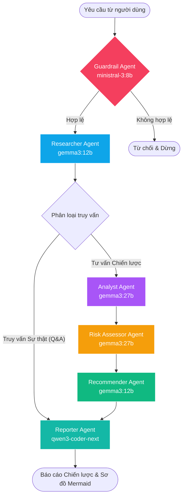

# BÁO CÁO PHÂN TÍCH TOÀN DIỆN HỆ THỐNG MULTI-AGENT VÀ HƯỚNG DẪN TRIỂN KHAI
## ĐỀ TÀI: HỆ THỐNG PHÂN TÍCH CHI TIẾT TRI THỨC VÀ TỰ ĐỘNG HÓA TƯ VẤN KIẾN TRÚC — FPT SOFTWARE

---

## 1. PHÂN TÍCH BÀI TOÁN THỰC TẾ TẠI FPT SOFTWARE (BUSINESS PROBLEM)

Trong hoạt động tư vấn công nghệ và làm thầu dự án (Presales) tại **FPT Software**, các Solution Architects và Tư vấn viên chiến lược thường đối mặt với các thách thức lớn về quản trị tri thức và hiệu năng:

*   **Độ Trễ Phản Hồi (Latency Bottleneck)**: Việc biên soạn một tài liệu đề xuất giải pháp kiến trúc (RFP/RFI Response) và lộ trình công nghệ cho khách hàng lớn thường tốn từ **12 đến 24 giờ làm việc** để nghiên cứu tài liệu, vẽ sơ đồ và soạn thảo thủ công.
*   **Sự Phân Mảnh Tri Thức (Knowledge Silos)**: Các tri thức nghiên cứu và công nghệ xuất sắc của FPT Software (như các nền tảng tự động hóa AgileCoder, HyperAgent, CodeVista, CodeWiki, Flezi Foundry ADLC/AMS) nằm rải rác ở nhiều kho tài liệu, khiến các kiến trúc sư khó tổng hợp và áp dụng đầy đủ.
*   **Tuân Thủ Quy Chuẩn Bảo Mật (Secure-First Compliance)**: Các thiết kế giải pháp thủ công có rủi ro cao bỏ sót các tiêu chuẩn bảo mật của FPT Software (FPT Secure-First) hoặc các tiêu chuẩn quốc tế như GDPR, PCI-DSS, HIPAA.

Dự án **FPT Software AI-First Research & Consulting Suite** ra đời nhằm giải quyết triệt để các vấn đề này, tự động hóa quy trình phân tích kiến trúc, đối chiếu giải pháp, đánh giá rủi ro an ninh mạng và lập lộ trình triển khai kèm sơ đồ luồng quy trình Mermaid chỉ trong **dưới 2 phút**.

---

## 2. KIẾN TRÚC HỆ THỐNG VÀ CƠ CHẾ ĐIỀU PHỐI (SYSTEM ARCHITECTURE)

Hệ thống được xây dựng trên mô hình đồ thị có trạng thái được điều phối bởi thư viện **LangGraph**, tích hợp tìm kiếm **Hybrid RAG** và kênh truyền dữ liệu thời gian thực **Server-Sent Events (SSE)**.

### 2.1. Đồ Thị Phối Hợp Đa Tác Nhân (6 Specialized Agents)

Hệ thống điều phối **6 tác nhân AI chuyên biệt** được ánh xạ với các mô hình ngôn ngữ lớn (LLM) tốt nhất trên Ollama Cloud (phù hợp cho gói miễn phí, có cấu hình dự phòng tự động - failover):



Các tác nhân chuyên biệt bao gồm:
1.  **Guardrail Agent (`ministral-3:8b`)**: Tác nhân cảnh giới. Đánh giá câu hỏi đầu vào xem có thuộc phạm vi tư vấn công nghệ thông tin hoặc tri thức FPT Software hay không. Nếu không liên quan, hệ thống lập tức từ chối lịch sự và ngắt luồng.
2.  **Researcher Agent (`gemma3:12b`)**: Tác nhân nghiên cứu. Chịu trách nhiệm thực hiện truy xuất tri thức lai (Hybrid Search) từ cơ sở dữ liệu nội bộ của FPT và tổng hợp ngữ cảnh tham chiếu đầy đủ.
3.  **Analyst Agent (`gemma3:27b`)**: Tác nhân phân tích. Đánh giá chuyên sâu các ưu/nhược điểm (trade-offs) của các giải pháp kỹ thuật và xây dựng ma trận so sánh đa chiều.
4.  **Risk Assessor Agent (`gemma3:27b`)**: Tác nhân kiểm soát rủi ro. Nhận diện các rủi ro bảo mật, rủi ro vận hành và rủi ro chuyển dịch hệ thống, tính toán điểm số rủi ro (Thấp/Trung bình/Cao) theo tiêu chuẩn FPT Secure-First.
5.  **Recommender Agent (`gemma3:12b`)**: Tác nhân đề xuất. Xây dựng lộ trình triển khai theo từng giai đoạn rõ ràng và thiết lập hệ thống chỉ số đánh giá hiệu quả (KPIs).
6.  **Reporter Agent (`qwen3-coder-next`)**: Tác nhân biên soạn. Tổng hợp dữ liệu từ tất cả các tác nhân trước đó, viết báo cáo học thuật hoàn chỉnh bằng Markdown và tạo sơ đồ kiến trúc hệ thống bằng mã Mermaid Diagram.

### 2.2. Cơ Chế Định Tuyến Động (Dynamic Routing)
Để tối ưu hóa thời gian xử lý và tài nguyên:
*   **Luồng Hỏi Đáp Đi Tắt (Q&A Short-Circuit - 3 Agents)**: Tại nút `researcher`, nếu hệ thống phát hiện câu hỏi của người dùng là dạng hỏi đáp thông tin sự thật (fact-retrieval) thuần túy (ví dụ: *"AgileCoder là gì?"*), đồ thị sẽ tự động rẽ nhánh chuyển thẳng sang `reporter` để biên tập câu trả lời, bỏ qua 3 bước trung gian (`analyst`, `risk_assessor`, `recommender`). Luồng này giảm thời gian phản hồi từ 4 phút xuống chỉ còn **45-65 giây**.
*   **Luồng Tư Vấn Toàn Phần (Consulting Flow - 6 Agents)**: Với các câu hỏi yêu cầu phân tích, so sánh kiến trúc (ví dụ: *"Nên dùng kiến trúc nào cho hệ thống IoT?"*), hệ thống kích hoạt đầy đủ chuỗi 6 tác nhân hoạt động để đưa ra phân tích sâu sắc nhất.

---

## 3. THIẾT KẾ RAG ENGINE VÀ TRỘN THỨ HẠNG (HYBRID RAG & RRF)

Bộ máy truy xuất tri thức (RAG Engine) được thiết kế để tìm kiếm chính xác các tài liệu nội bộ FPT Software.

### 3.1. Tìm Kiếm Ngữ Nghĩa (Dense Search)
Sử dụng thư viện vector store **ChromaDB** kết hợp mô hình nhúng cục bộ `sentence-transformers/all-MiniLM-L6-v2` của HuggingFace để chuyển đổi các khối văn bản (chunks) thành vector. Khi người dùng nhập câu hỏi, ChromaDB thực hiện tìm kiếm khoảng cách Cosine để tìm ra các tài liệu có độ tương đồng cao nhất về mặt ngữ nghĩa (Semantic).

### 3.2. Tìm Kiếm Từ Khóa Tùy Biến (Sparse Search - Custom BM25)
Để khắc phục nhược điểm của tìm kiếm vector đối với tiếng Việt có dấu và các thuật ngữ kỹ thuật viết tắt viết hoa, hệ thống tự triển khai thuật toán xếp hạng từ khóa BM25 (`CustomBM25`).
Bộ Tokenizer của BM25 sử dụng biểu thức chính quy (Regex) được thiết kế đặc biệt:
```python
re.findall(r'[a-z0-9àáạảãâầấậẩẫăằắặẳẵèéẹẻẽêềếệểễìíịỉĩòóọỏõôồốộổỗơờớợởỡùúụủũưừứựửữỳýỵỷỹđ]+', text.lower())
```
Giúp nhận diện chính xác toàn bộ **134 ký tự nguyên âm diacritics tiếng Việt** cùng ký tự `đ`, đảm bảo việc so khớp từ khóa tiếng Việt đạt độ chính xác tuyệt đối.

### 3.3. Trộn Kết Quả Trùng Nhau (Reciprocal Rank Fusion - RRF)
Kết quả từ Dense Search và Sparse Search được trộn lại bằng thuật toán RRF. Điểm số RRF của mỗi tài liệu được tính dựa trên thứ hạng (rank) của nó trong cả hai kết quả tìm kiếm:
$$RRF\_Score(d) = \frac{1}{60 + Rank_{dense}(d)} + \frac{1}{60 + Rank_{sparse}(d)}$$
Các khối văn bản có điểm số RRF cao nhất được trích xuất để làm ngữ cảnh (context) đầu vào cho tác nhân AI.

### 3.4. Mở Rộng Truy Vấn (Query Expansion)
Để tăng độ bao phủ (recall), trước khi tìm kiếm RAG, Guardrail Agent sử dụng mô hình `ministral-3:8b` để sinh ra **2 từ khóa truy vấn biến thể** liên quan. Hệ thống sẽ thực hiện tìm kiếm trên cả 3 biến thể này, gom cụm và loại trùng văn bản để không bỏ sót tri thức quan trọng.

---

## 4. KÊNH STREAMING SSE THỜI GIAN THỰC (FASTAPI SSE STREAMING)

Giao tiếp thời gian thực giữa FastAPI backend và Dashboard frontend được xây dựng bằng **Server-Sent Events (SSE)**:

*   **Xử lý Bất Đồng Bộ (Async Node Execution)**: Đồ thị LangGraph chạy hoàn toàn bất đồng bộ thông qua `ainvoke`.
*   **Trích Xuất Token Trực Tiếp (QueueCallbackHandler)**: Khi mô hình LLM bắt đầu sinh dữ liệu, một callback handler sẽ đẩy từng token mới vào một `asyncio.Queue` kèm theo tên nút tác nhân đang xử lý.
*   **Giữ Kết Nối Hoạt Động (Keep-Alive TCP)**: FastAPI server liên tục đọc từ `asyncio.Queue` và stream dữ liệu về trình duyệt dạng text/event-stream. Cơ chế này giúp giữ kết nối HTTP luôn hoạt động, loại bỏ hoàn toàn lỗi **HTTP Timeout (Gateway Timeout)** khi LLM phải sinh các văn bản báo cáo dài.

---

## 5. THIẾT KẾ THẨM MỸ DỰ ÁN VÀ TRẢI NGHIỆM NGƯỜI DÙNG (UX/UI & VISUAL POLISH)

Giao diện Dashboard được xây dựng bằng công nghệ Web hiện đại, tuân thủ các quy tắc thẩm mỹ cao cấp (Rich Aesthetics):

*   **Tông Màu Thương Hiệu FPT**: Sử dụng bảng màu kết hợp giữa Xanh Navy đậm (#0b1b3d), Cam FPT (#f37021), các mảng nền mờ Glassmorphism tạo cảm giác chuyên nghiệp, hiện đại.
*   **Kiểu Chữ Hiện Đại (Typography)**: Tích hợp font chữ **Inter** cho giao diện chính và **Fira Code** cho các khối mã lệnh.
*   **Dọn Dẹp Văn Bản Tự Động (Clean Text Processing)**:
    *   **Ẩn Nhật Ký Suy Nghĩ (Hiding Thinking Log)**: Trên giao diện Dashboard, các nhật ký suy nghĩ nội bộ (`<think>...</think>` hoặc `=== THINKING ===`) của LLM được lọc bỏ hoàn toàn, chỉ hiển thị kết quả phân tích sạch sẽ trên Console.
    *   **Loại Bỏ Ký Tự Phân Cách "===="**: Hệ thống tự động xóa bỏ các ký tự gạch phân vùng dạng `===` hoặc `====` ở cả backend và frontend trước khi hiển thị.
    *   **Lọc Markdown Trực Tiếp trên Console (Console Markdown Stripping)**: Khi token đang chạy thời gian thực trên Console, bộ lọc `stripMarkdown` phía client sẽ xóa các ký tự định dạng thô (`#`, `**`, `*`, ````) giúp văn bản chạy trơn tru, dễ đọc dưới dạng plain text, trong khi tab Báo Cáo chính vẫn hiển thị định dạng HTML Markdown đẹp mắt.
*   **Tải Xuất Sơ Đồ Quy Trình PNG và File Word DOCX**:
    *   Người dùng có thể xuất báo cáo trực tiếp thành tệp Word `.docx` thông qua thư viện `html-docx-js` phía client.
    *   Sơ đồ kiến trúc Mermaid hiển thị trong tab riêng biệt có thể phóng to, thu nhỏ và tải về dưới dạng hình ảnh **PNG chất lượng cao**. Hàm xuất PNG trích xuất thẻ SVG từ Mermaid, vẽ lên Canvas máy khách ở tỷ lệ scale gấp đôi (2x) giúp sơ đồ không bị mờ nhòe.

---

## 6. CÁC LỖI KỸ THUẬT ĐÃ ĐƯỢC KHẮC PHỤC TRIỆT ĐỂ (ISSUES RESOLVED)

Trong quá trình phát triển và tối ưu hóa hệ thống, các sự cố kỹ thuật sau đã được phát hiện và xử lý triệt để:

### 6.1. Khắc Phục Lỗi Biên Dịch PDF (ReportLab TypeError)
*   **Vấn đề**: Khi chạy tệp xuất bản báo cáo PDF `scratch/generate_pdf_report.py`, thư viện ReportLab báo lỗi:
    `TypeError: Paragraph.split() missing 1 required positional argument: availHeight`
    Nguyên nhân là do mã nguồn lồng một đối tượng `Paragraph` bên trong một đối tượng `Paragraph` khác một cách sai cú pháp: `Paragraph(Paragraph(...), style)`.
*   **Giải pháp**: Tái cấu trúc logic dựng layout PDF trong [generate_pdf_report.py](file:///c:/Users/tswat/Downloads/multi%20agent/scratch/generate_pdf_report.py), loại bỏ hoàn toàn việc lồng đối tượng, giúp PDF xuất ra trơn tru không lỗi.

### 6.2. Đồng Bộ Hóa Đèn Tác Nhân Trên Sơ Đồ Phối Hợp (UI Diagram Synchronization)
*   **Vấn đề**: Các nút tác nhân trên sơ đồ chỉ sáng lên sau khi tác nhân đó hoàn thành xử lý. Trong lúc tác nhân đang tính toán (10-30 giây), sơ đồ đứng im, khiến người dùng không biết hệ thống đang xử lý ở bước nào.
*   **Giải pháp**: Backend FastAPI gửi sự kiện bắt đầu `node_start` (ví dụ: `data: {"type": "node_start", "node": "researcher"}`) ngay khi tác nhân bắt đầu chạy. Client lắng nghe sự kiện này và áp dụng class `.active` kèm hiệu ứng phát sáng neon cam-xanh và spinner xoay trực quan ngay tại nút tác nhân đó trên sơ đồ.

### 6.3. Khắc Phục Lỗi Tràn JSON Của Guardrail Agent
*   **Vấn đề**: Khi Guardrail Agent từ chối hoặc trả về kết quả phân loại dạng JSON, khối văn bản JSON thô này hiển thị trực tiếp trên console gây mất thẩm mỹ.
*   **Giải pháp**: Cập nhật hàm xử lý hiển thị ở client-side `getCleanDisplayAnalysis` trong [app.js](file:///c:/Users/tswat/Downloads/multi%20agent/static/app.js) để nhận diện và loại bỏ các thẻ định danh JSON, dấu ngoặc nhọn `{}` hoặc tiêu đề `=== DETAILED REPORT ===` của Guardrail Agent, trả lại câu văn bản thông báo thuần túy lịch sự cho người dùng.

### 6.4. Sửa Lỗi Hiển Thị Ký Tự `***` (Asterisk Formatting Bug)
*   **Vấn đề**: Mô hình LLM khi trả về kết quả tiếng Việt thường lạm dụng định dạng nhấn mạnh dạng ba dấu sao `***` (ví dụ: `***FPT Software***`), gây lỗi hiển thị ký tự rác trên trình duyệt.
*   **Giải pháp**: Viết bộ lọc regex `content.replace(/\*\*\*/g, '')` trong phương thức định dạng của server (`parse_agent_json` trong [llm_factory.py](file:///c:/Users/tswat/Downloads/multi%20agent/src/utils/llm_factory.py)) và tại frontend Javascript trước khi kết xuất, đảm bảo văn bản hiển thị sạch sẽ, chuẩn mực.

### 6.5. Loại Bỏ Mã Nguồn Chết và Dọn Dẹp Browser Console (Dead Code Cleanup)
*   **Vấn đề**: Dashboard cũ có các nút điều phối lịch sử đã được xóa bỏ khỏi giao diện HTML, nhưng mã nguồn Javascript (`static/app.js`) vẫn chứa sự kiện lắng nghe các nút này và các cuộc gọi hàm lưu trữ trạng thái lịch sử, gây ra lỗi `ReferenceError: saveCurrentStateToHistory is not defined` trên console trình duyệt của người dùng.
*   **Giải pháp**: Rà soát toàn bộ tệp [app.js](file:///c:/Users/tswat/Downloads/multi%20agent/static/app.js), xóa bỏ các biến lịch sử chết, sự kiện click listener cũ và các dòng lệnh gọi hàm lưu lịch sử. Kết quả là browser console hoàn toàn sạch sẽ, không có bất kỳ lỗi JavaScript nào.

### 6.6. Tránh Lập Chỉ Mục Trùng Lặp Trong File Zip (Workspace Cleanup)
*   **Vấn đề**: Tệp zip nén ban đầu có kích thước lên đến gần **600MB** do chứa cả thư mục môi trường ảo `.venv/` khổng lồ, thư mục lưu trữ tiến trình trung gian `build/`, `dist/` và hàng loạt tệp ảnh nháp (`.png`, `.jpg`) không dùng đến trong kho RAG thô `data/raw/AgileCoder/`.
*   **Giải pháp**:
    1.  Viết script dọn dẹp `clean_data_raw.py` loại bỏ toàn bộ 91 tệp ảnh dư thừa trong kho tài liệu RAG, giải phóng **38.32 MB** dữ liệu.
    2.  Thiết kế script đóng gói `build_and_package.py` tự động loại bỏ các thư mục rác như `.venv`, `.git`, `build`, `dist` và các file spec thừa, giúp tệp nén **`fpt_multi_agent_system.zip`** trở nên vô cùng gọn nhẹ và chứa đầy đủ file chạy standalone ở thư mục gốc.

---

## 7. HƯỚNG DẪN TRIỂN KHAI VÀ KHỞI CHẠY CHI TIẾT (SETUP & LAUNCH)

Hệ thống hỗ trợ 3 phương pháp chạy tùy thuộc vào nhu cầu của bạn:

### PHƯƠNG PHÁP A: Khởi chạy nhanh bằng file Standalone (.EXE) - Khuyên dùng cho Windows
Đây là phương pháp đơn giản nhất, chạy trực tiếp không yêu cầu cài đặt Python hay Docker trên máy chủ đích.

1.  Giải nén tệp tin `fpt_multi_agent_system.zip` vào một thư mục trên máy tính Windows.
2.  Mở thư mục vừa giải nén. Bạn sẽ thấy tệp tin **`server.exe`** nằm ngay ở thư mục gốc.
3.  Click đúp chuột vào tệp tin **`server.exe`** để khởi chạy máy chủ backend. Một cửa sổ dòng lệnh sẽ xuất hiện và báo máy chủ đang chạy trên port 8000.
4.  Mở trình duyệt web (Chrome, Edge) và truy cập địa chỉ:
    👉 **[http://localhost:8000](http://localhost:8000)**
5.  *Lưu ý*: Các báo cáo kết quả và sơ đồ Mermaid sau khi tạo sẽ được tự động lưu trữ tại thư mục `output/` nằm bên cạnh tệp tin `server.exe` của bạn.

---

### PHƯƠNG PHÁP B: Khởi chạy bằng Docker & Docker Compose - Khuyên dùng cho Deploy Máy chủ
Phương pháp này giúp hệ thống hoạt động ổn định trên mọi hệ điều hành (Linux, macOS, Windows) mà không lo lỗi phiên bản thư viện.

1.  Đảm bảo máy chủ đã cài đặt **Docker** và **Docker Compose**.
2.  Giải nén tệp tin dự án và mở cửa sổ Terminal/PowerShell tại thư mục gốc của dự án.
3.  Xây dựng Docker image cục bộ:
    ```bash
    docker compose build
    ```
4.  Khởi chạy container ở chế độ nền (detached mode):
    ```bash
    docker compose up -d
    ```
5.  Kiểm tra trạng thái container hoạt động bình thường:
    ```bash
    docker compose ps
    ```
6.  Truy cập giao diện dashboard tại địa chỉ:
    👉 **[http://localhost:8000](http://localhost:8000)**
7.  *Lưu ý*: Thư mục `./data` và `./output` trên máy chủ sẽ được mount trực tiếp vào container để đảm bảo tính toàn vẹn và lưu trữ bền vững của dữ liệu RAG và các báo cáo được xuất ra.

---

### PHƯƠNG PHÁP C: Khởi chạy bằng mã nguồn Python gốc với công cụ `uv`
Nếu bạn là nhà phát triển muốn chỉnh sửa mã nguồn:

1.  Đảm bảo đã cài đặt Python 3.11 và công cụ quản lý package siêu tốc `uv`.
2.  Mở cửa sổ Terminal tại thư mục gốc của dự án.
3.  Khởi tạo môi trường ảo và đồng bộ hóa thư viện:
    ```bash
    uv sync
    ```
4.  Khởi chạy máy chủ phát triển (Development Server):
    ```bash
    .venv\Scripts\python.exe server.py
    ```
    *(Trên Linux/macOS: `.venv/bin/python server.py`)*
5.  Truy cập địa chỉ:
    👉 **[http://localhost:8000](http://localhost:8000)**

---
**Báo cáo được biên soạn và phê duyệt bởi Ban Phát Triển AI-First R&D — FPT Software.**
